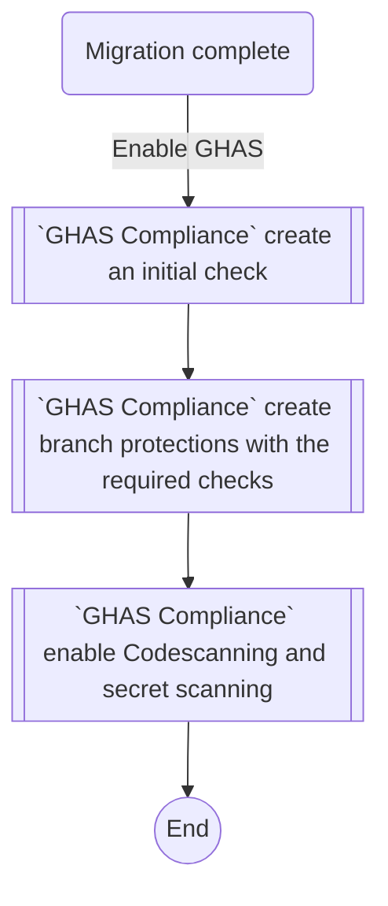
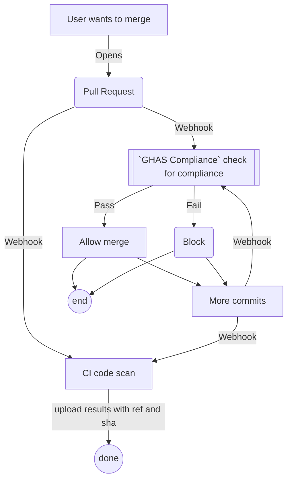
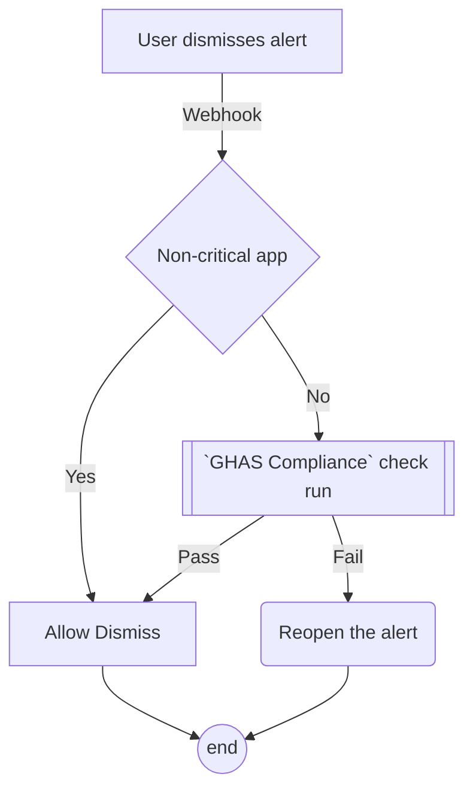
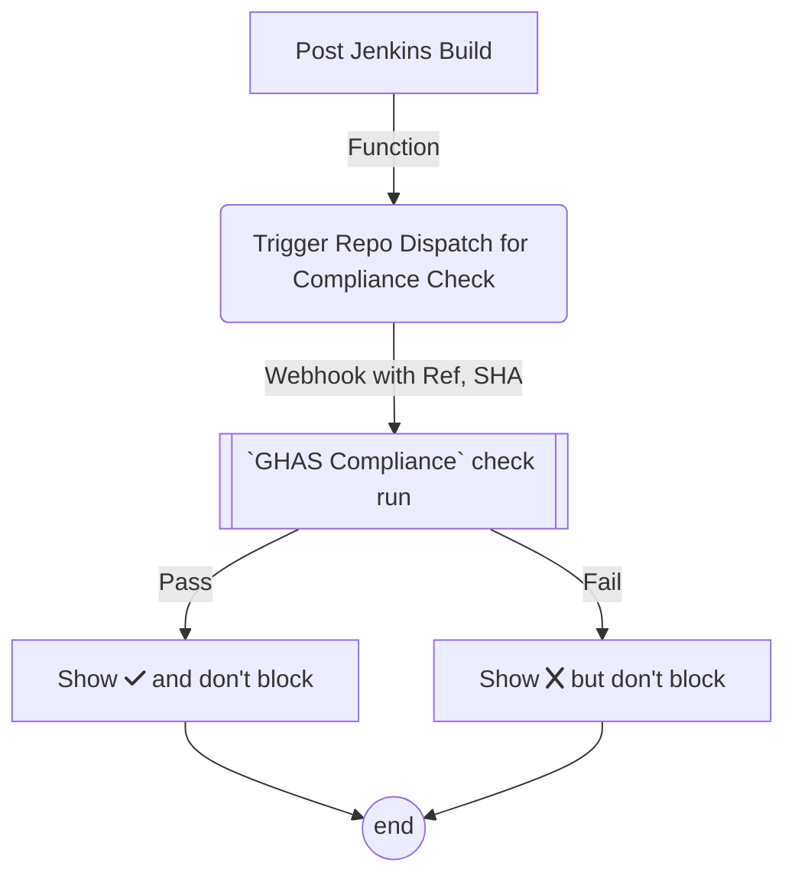
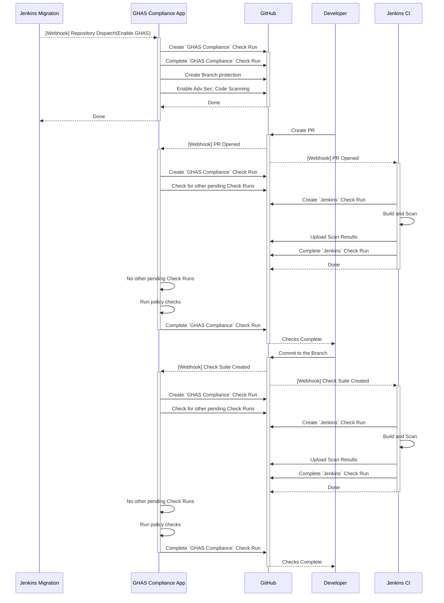

# ghas-compliance

A GitHub App built with [Probot](https://github.com/probot/probot) for enforcing GHAS compliance policies.  
App will block merges for high severity alerts for critical apps and allow merges of PRs for non-critical, no-internet access (NCNIA) apps.  

## Runtime settings
The `GHAS-Compliance` app can be set up with runtime config. The location of runtime config is either the `$basedir/runtime.yml` where the app is running or the path pointed to by `RUNTIME_SETTINGS_FILE` env variable.   
Here is a sample runtime.yml:
```yaml
branches:
  protection:
  patterns: ["main", "something"]
bypasschecks:
  always: false
  topics: ['ncnia']
repodispatch:
  createInitialCheck: true
  createBranchProtection: true
  enableAdvSec: true
policy:
  snooze: 20
```
|value|description
|--|--|
`branches.pattern`:| The list of branches branches where protection would be applied.  
`bypasschecks.always`:| true - skip PR checks (GHAS Compliance PR checks will pass)
`bypasschecks.topics`:| [repo topics] which will skip PR checks (GHAS Compliance PR checks will pass)
`repodispatch.createInitialCheck`:| false will skip creating the initial check for the repo dispatch event
`repodispatch.createBranchProtection`:| false will skip creating the branch protection for the repo dispatch event
`repodispatch.enableAdvSec`:| false will skip enabling Advanced Security
`policy.snooze`:| snooze time in secs


## Workflows
The various workflows this app will address are illustrated below:

### On-Demand Post-Migration Workflow

### PR based GHAS Compliance Workflow

### Alert Dismissal Workflow


### On-Demand GHAS Compliance Workflow


## Sequence Diagram


## Setup

Follow the instructions in [Deploy.md](docs/deploy.md)

## Contributing

If you have suggestions for how ghas-compliance could be improved, or want to report a bug, open an issue! We'd love all and any contributions.

For more, check out the [Contributing Guide](CONTRIBUTING.md).

## License

[ISC](LICENSE) © 2022 Yadhav Jayaraman <decyjphr@github.com>
