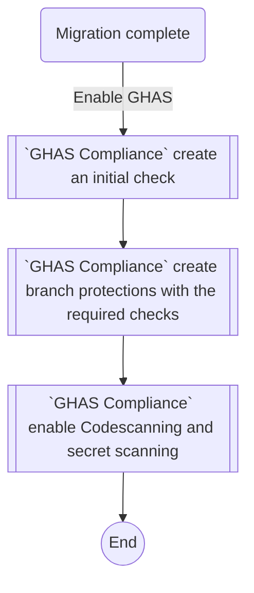
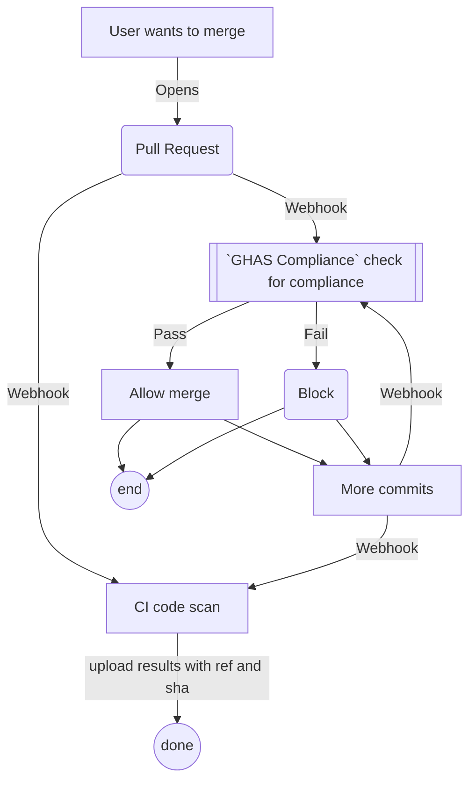
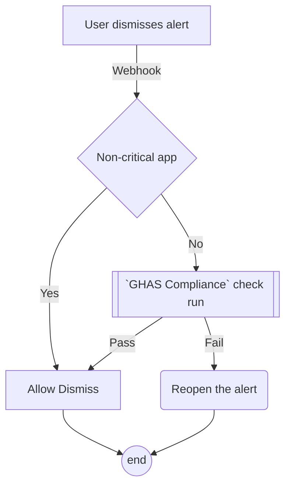
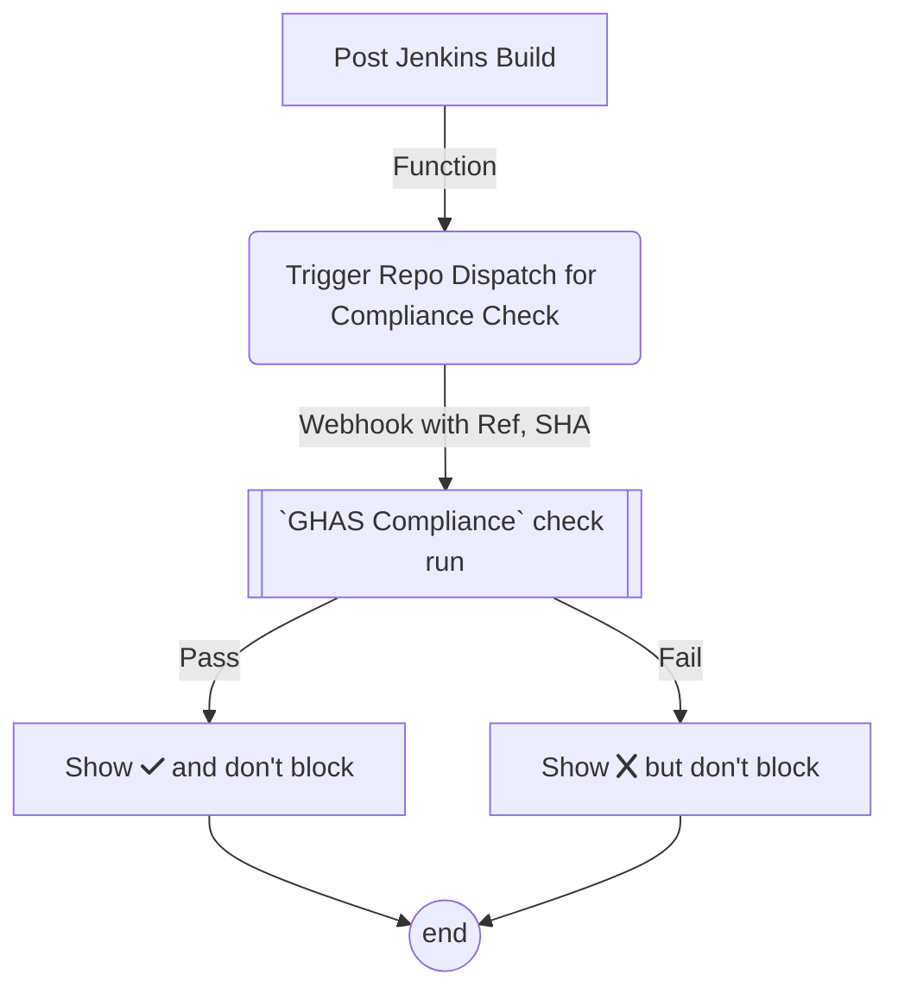
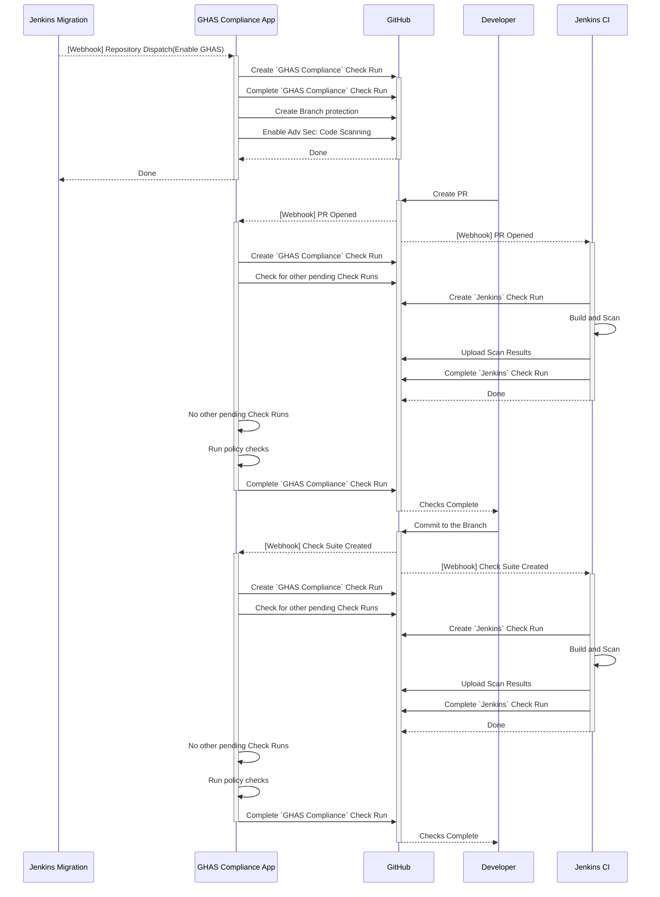

# ghas-compliance 

A GitHub App built with [Probot](https://github.com/probot/probot) for enforcing GHAS compliance policies.  
App will block merges for high severity alerts for critical apps and allow merges of PRs for non-critical, no-internet access (NCNIA) apps.  

## Workflows
The various workflows this app will address are illustrated below:

### On-Demand Post-Migration Workflow

### PR based GHAS Compliance Workflow

### Alert Dismissal Workflow


### On-Demand GHAS Compliance Workflow


## Sequence Diagram


## Runtime Config
The app will look for runtime settings file that is referenced by the `RUNTIME_SETTINGS_FILE` value in the environment (or .env file).  

`NOTE`: It's best to provide the full path instead of the relative path for the `runtime` settings file. If you are providing a relative path, start with `../` to get to the root directory of the app and then provide the relative path. E.g. `../myconfig.yml` where myconfig.yml is at the root dir.

Here is a sample `runtime` config:

```yaml
branches:
  protection:
  patterns: ["main", "something"]
bypasschecks:
  always: false
  topics: ['ncnia']
repodispatch:
  createInitialCheck: true
  createBranchProtection: true
  enableAdvSec: true
policy:
  snooze: 20
policyPath:
  owner: 'decyjphr-org'
  repo: 'security-queries'
  path: 'policies/custom.yml'
  ref: 'main' 
emptyPolicy:
  codescanning:
    level: 
    conditions:
      ids: []
      names: []
      cwes: []
    ignores:
      ids: []
      names: []
      cwes: []
  secretscanning:
    conditions:
      types: []
    ignores:
      types: []
```

### Values in Runtime config
value | Desc
-- | --
bypasschecks.always | [true/false] Bypass check runs for all repos
bypasschecks.topics | List of topics for targeting repos to bypass the checks
repodispatch.createInitialCheck | [true/false] Create an initial check
repodispatch.createBranchProtection | [true/false] Create initial branch protection and add `GHAS Compliance` as required check
repodispatch.enableAdvSec | [true/false] Enable Adv Sec for the repo
policy.snooze | [integer] interval of seconds to snooze between checking if other CI jobs have completed
policyPath.owner | Default for the `Org` where the policy files are stored. 
policyPath.repo | Default for the `Repo` where the policy files are stored. 
policyPath.path | Default for the `filepath` for the policy file. 
policyPath.ref | Default for the `ref` for the policy file. 
emptyPolicy | Provide an empty policy file if the above policy file does not exist

`NOTE`: 
If `RUNTIME_SETTINGS_FILE` is not provided in the env, it would default to `runtime.yml` file at the root of the application. 

`NOTE`:  
If no runtime settings is provided, it would default to a hard-coded setting as follows:
```yaml
branches:
  protection:
  patterns: []
bypasschecks:
  always: false
  topics: []
repodispatch:
  createInitialCheck: true
  createBranchProtection: true
  enableAdvSec: true
policy:
  snooze: 20
policyPath:
  owner: 
  repo:
  path:
  ref:
emptyPolicy:
  codescanning:
    level: 
    conditions:
      ids: []
      names: []
      cwes: []
    ignores:
      ids: []
      names: []
      cwes: []
  secretscanning:
    conditions:
      types: []
    ignores:
      types: []
```

`NOTE`: 

The default `policypath` settings in the `runtime` config can be overriden in the repos by having a  `.github/policypath.yml` file.

## Policy
The policy config will allow an user to define 2 types of rules for
- code scanning
- secret scanning

Here is a sample policy file:
```yaml
codescanning:
  level: critical
  conditions:
    ids:
      - "*/sql-injection"
      - "*/xss"
      - "*/stored-xss"
      - "*/command-line-injection"
      - "*/zipslip"
    cwes:
      - cwe-0221
  ignores:
    ids:
      - js/log-injection
    names:
      - "Missing rate limiting"
      
secretscanning:
  conditions:
    types: 
    - "*"
  ignores:
    types: 
    - "aws*"
```

### Blocks
Each policy has blocks for `conditions` and `ignores`. They could be based on `ids`,`names`,`cwes` for code scanning; and based on `types` for secret scanning.

### Levels
Code Scanning policy could also be based on levels. The levels are:
`['notes', 'warning', 'low', 'moderate', 'medium', 'error', 'high', 'critical']`

### Known Issues
1. For a policy author, there is no simple way to map `secret_type_display_name` to `secret_type`. When an alert is dismissed, we get the alert event object with the `secret_type` as an attribute, but not `secret_type_display_name`. However, in the UI we don't see the `secret_type`; only `secret_type_display_name`, So as a policy author writing policies, I need to do the translation of what I see in the UI to the secret_type.
2. For a policy author, there is no simple way to categorize all partner secrets from custom secrets. The workaround is to have all custom secrets follow a naming convention.
3. For a policy author, the `cwe` labels using in Github might require a leading `0`. For e.g. `cwe-21` should be written as `cwe-021`

## Setup
Follow the instructions in [Deploy.md](docs/deploy.md)

## Contributing

If you have suggestions for how ghas-compliance could be improved, or want to report a bug, open an issue! We'd love all and any contributions.

For more, check out the [Contributing Guide](CONTRIBUTING.md).

## License

[MIT](LICENSE) © 2022 GitHub <decyjphr@github.com>
