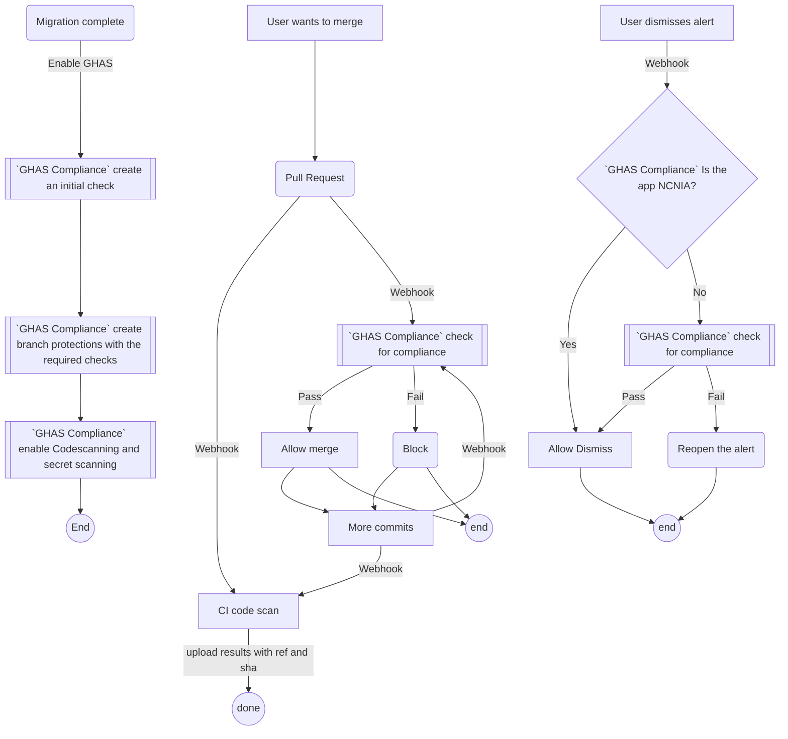

# ghas-compliance

A GitHub App built with [Probot](https://github.com/probot/probot) that to set compliance policies.  
App will block merges for high severity alerts for critical apps and allow merges of PRs for Non critical, no internet access (NCNIA) apps.  
The various workflows this app will address are illustrated below:



## Setup

```sh
# Install dependencies
npm install

# Run the bot
npm start
```

## Docker

```sh
# 1. Build container
docker build -t ghas-compliance .

# 2. Start container
docker run -e APP_ID=<app-id> -e PRIVATE_KEY=<pem-value> ghas-compliance
```

## Contributing

If you have suggestions for how ghas-compliance could be improved, or want to report a bug, open an issue! We'd love all and any contributions.

For more, check out the [Contributing Guide](CONTRIBUTING.md).

## License

[ISC](LICENSE) © 2022 Yadhav Jayaraman <decyjphr@github.com>
