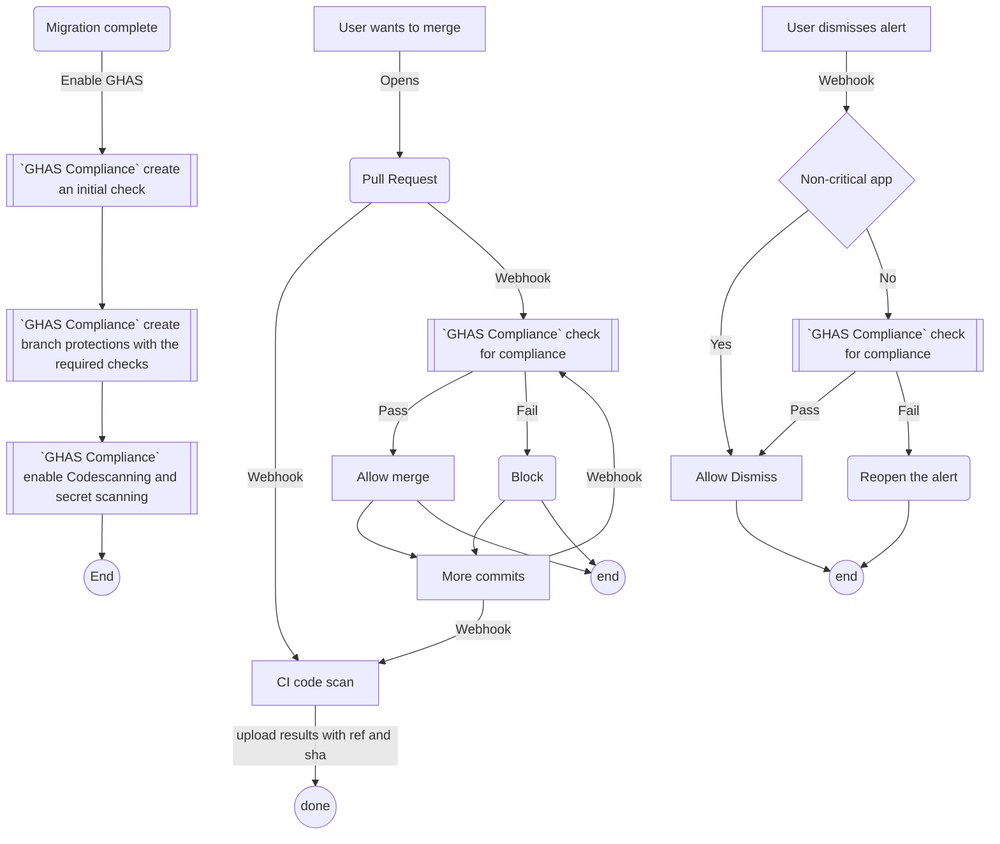

# ghas-compliance

A GitHub App built with [Probot](https://github.com/probot/probot) for enforcing GHAS compliance policies.  
App will block merges for high severity alerts for critical apps and allow merges of PRs for non-critical, no-internet access (NCNIA) apps.  

## Workflows
The various workflows this app will address are illustrated below:

## Sequence Diagram

## Setup

Follow the instructions in [Deploy.md](docs/deploy.md)

## Contributing

If you have suggestions for how ghas-compliance could be improved, or want to report a bug, open an issue! We'd love all and any contributions.

For more, check out the [Contributing Guide](CONTRIBUTING.md).

## License

[ISC](LICENSE) © 2022 Yadhav Jayaraman <decyjphr@github.com>
